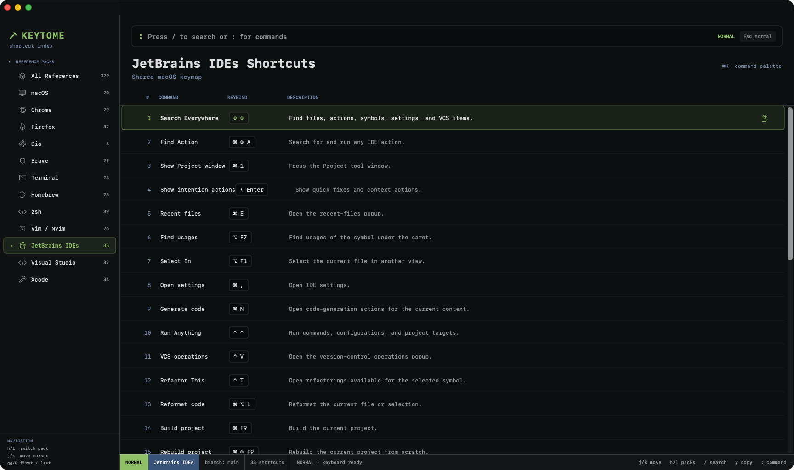

<p align="center">
  
</p>

<h1 align="center">Keytome</h1>

<p align="center">
  A fast, offline keyboard-shortcut and command reference for macOS.
</p>

<p align="center">
  <a href="https://github.com/Saba-Burduli/keytome-macos/actions/workflows/ci.yml"></a>
  <a href="https://github.com/Saba-Burduli/keytome-macos/releases/latest"></a>
  
  
  
</p>

<p align="center">
  <a href="https://github.com/Saba-Burduli/keytome-macos/releases/download/v1.1.0/Keytome-1.1.0.dmg"><strong>Download Keytome for macOS</strong></a>
</p>



Keytome keeps frequently used shortcuts and commands in one keyboard-driven native app. It works entirely offline, requires no account, and includes no analytics, backend, updater, or network dependency.

## Install

Keytome requires macOS 14 or newer.

1. Download [`Keytome-1.1.0.dmg`](https://github.com/Saba-Burduli/keytome-macos/releases/download/v1.1.0/Keytome-1.1.0.dmg).
2. Open the downloaded DMG.
3. Drag **Keytome** onto the **Applications** folder shown in the installer.
4. Eject the Keytome disk image.
5. Open Keytome from `/Applications`.

### First launch and Gatekeeper

The current public build is ad-hoc signed and not Apple-notarized. On first launch, macOS may block it because it cannot verify the developer.

1. Open the Applications folder in Finder.
2. Control-click **Keytome** and choose **Open**.
3. Select **Open** in the confirmation dialog.

If that option is unavailable, try launching Keytome once, then open **System Settings → Privacy & Security**, find the blocked-app message, and select **Open Anyway**.

## Included reference packs

- macOS and Finder
- Chrome, Firefox, Brave, and common Dia conventions
- Terminal.app and shell editing
- Homebrew
- zsh
- Vim and Neovim
- JetBrains IDEs using the shared macOS keymap
- Visual Studio using the Windows General profile
- Xcode

Dia entries are intentionally marked `COMMON` because no complete public official Dia shortcut reference was available. Source and confidence details are maintained in [`docs/SOURCES.md`](docs/SOURCES.md).

## Keyboard workflow

| Key | Action |
| --- | --- |
| `j` / `k` | Move through references |
| `h` / `l` | Switch reference packs |
| `gg` / `G` | Jump to the first or last result |
| `/` or `⌘F` | Search |
| `n` / `N` | Next or previous result |
| `:` or `⌘K` | Open command mode |
| `y`, `Enter`, or `⌘C` | Copy the selected value |
| `?` | Show keyboard help |
| `Esc` | Return to normal mode |

Command mode supports `:search`, `:open`, `:next`, `:prev`, `:clear`, and `:help`.

## Run from source

Requirements: macOS 14 or newer and Xcode 16, or another compatible Swift 6 toolchain.

```bash
git clone https://github.com/Saba-Burduli/keytome-macos.git
cd keytome-macos
./script/build_and_run.sh
```

The script builds Keytome, stages `dist/Keytome.app`, and launches it. To stage and verify that the process starts:

```bash
./script/build_and_run.sh --verify
```

Run the test suite with:

```bash
swift test
```

## Add a reference pack

1. Add the category and SF Symbol mapping in [`ReferenceCategory.swift`](Sources/Keytome/Models/ReferenceCategory.swift).
2. Add typed `ReferenceItem` values in [`SeedData.swift`](Sources/Keytome/Data/SeedData.swift).
3. Include the new collection in `SeedData.items`.
4. Add search and data-integrity tests for the new behavior.

Every bundled entry has a stable ID, title, copyable value, description, category, kind, tags, and confidence level. Follow the sourcing policy in [`docs/SOURCES.md`](docs/SOURCES.md); do not label community-reported shortcuts as verified without primary documentation.

## Project layout

```text
Sources/Keytome/
├── App/          App entry point and native menus
├── Components/   Reusable rows and controls
├── Data/         Repository and bundled reference data
├── Models/       Reference and navigation types
├── Stores/       Application session state
├── Support/      Search, theme, accessibility, and pasteboard helpers
└── Views/        Sidebar, list, header, footer, and empty states

Tests/KeytomeTests/
Resources/
script/
```

## Package a release

```bash
./script/package_release.sh 1.1.0
```

This produces `dist/Keytome-1.1.0.dmg`. Without Apple credentials it creates an ad-hoc signed, non-notarized DMG. When complete Developer ID and App Store Connect credentials are configured, the same script signs, notarizes, staples, and validates the release automatically.

## Roadmap

- Favorites and recently copied references
- Importable local reference packs
- Configurable key display and custom mappings
- Verified Dia-specific references

## License

Keytome is source-available proprietary software. Copyright © 2026 Saba Burduli. All rights reserved. No open-source license is granted. See [`NOTICE`](NOTICE).
